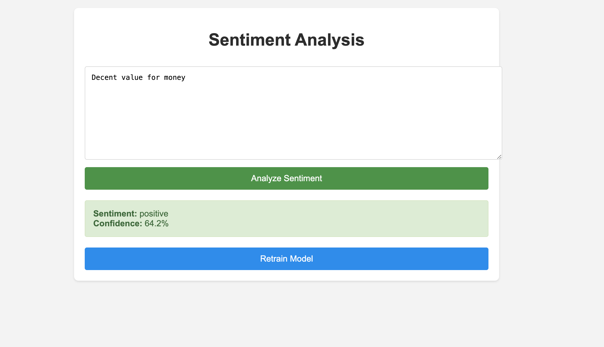

# Sentiment Analysis Application

## Overview
A machine learning-powered web application that analyzes the sentiment of text input. The application provides sentiment classification (positive/negative) along with a confidence score for the prediction.

## Features
- Real-time sentiment analysis of text input
- Confidence score display
- Model retraining capability
- Clean and intuitive user interface
- Support for processing natural language text

## Screenshot


## Installation
```bash
pip install -r requirements.txt
```

## Usage
1. Run the training script to initialize or retrain the model:
```bash
python train.py
```

2. Start the web application:
```bash
python app.py
```

3. Open your browser and navigate to `http://localhost:5000`

## How It Works
The application uses a machine learning model trained on text data to classify sentiments. Users can:
1. Enter text in the input field
2. Click "Analyze Sentiment" to get the prediction
3. View the sentiment result and confidence score
4. Optionally retrain the model with new data

## Requirements
See `requirements.txt` for a full list of dependencies.

## Contributing
1. Fork the repository
2. Create a new branch for your feature
3. Submit a pull request

## License
MIT License
